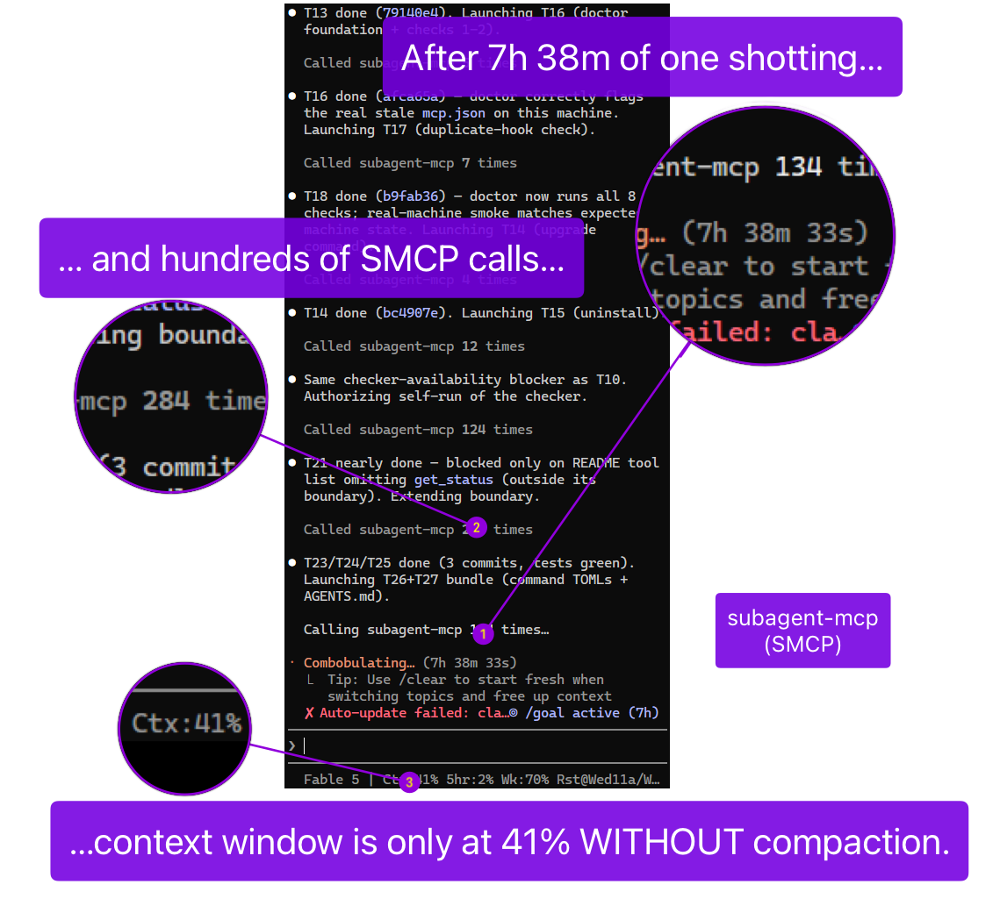

# subagent-mcp

[](https://www.npmjs.com/package/@heretyc/subagent-mcp)
[](LICENSE)
[](https://www.npmjs.com/package/@heretyc/subagent-mcp)
[](https://github.com/Heretyc/subagent-mcp/actions/workflows/claude-routine.yml)

## Core Premise

subagent-mcp is an MCP stdio server that turns an AI coding assistant (Claude
Code, Codex, Gemini CLI) into a manager of local Claude and Codex sub-agents on
macOS, Linux, and Windows. It orchestrates the locally authenticated `claude`
and `codex` CLIs you already signed into, and can route tasks to direct API
providers (Claude Messages API and OpenAI-compatible) configured in
`providers.jsonc`. Provider credentials stay out of config: `providers.jsonc`
names env vars, and key values live in the adjacent gitignored `.env`. API HTTP
is confined to `src/providers/provider-client.ts`.



*7 h 38 min one-shot coding session, several hundred tool calls, Fable 5, July 15 2026 - 41% context used, no auto-compaction, orchestrated via subagent-mcp.*

The orchestrator monitors but does not read or write project files itself. Work
is delegated to fresh sub-agents, so the orchestrator keeps summaries instead
of raw file context. The main invariants are:

- one machine-global, provider-agnostic concurrency cap (default 20, minimum 10)
- fail-safe orchestration ON on hookless hosts
- state authority only from harness-verified `<subagent-mcp state="...">` tags
- sub-agents gated by default with permission ceiling `auto`
- automatic model, provider, and effort routing per task category

## Install

### What You Need First

- Node.js 20 or newer (`node --version`)
- `claude` CLI, installed and signed in (`claude --version`)
- `codex` CLI, installed and signed in (`codex --version`; optional if you only
  use Claude)

Building from source needs extra developer tools. See
[CONTRIBUTING.md](CONTRIBUTING.md).

### Install The Package

Marketplace plugin for Claude Code:

```bash
claude plugin marketplace add Heretyc/subagent-mcp
claude plugin install subagent-mcp@subagent-mcp
```

Marketplace plugin for Codex:

```bash
codex plugin marketplace add Heretyc/subagent-mcp
codex plugin add subagent-mcp@subagent-mcp
```

Or Codex MCP registration:

```bash
codex mcp add subagent-mcp -- node /abs/path/to/subagent-mcp/dist/index.js
```

Or install the npm package globally:

```bash
npm install -g @heretyc/subagent-mcp
```

Organizations pinning the package through GitHub Packages should see
[docs/registration/prerequisites-and-install.md](docs/registration/prerequisites-and-install.md).

### Wire It Into Your Assistant

```bash
subagent-mcp setup
```

Installing the package only ships the program. It does not connect anything on
its own. `subagent-mcp setup` finds your Claude Code or Codex install and
registers both the server and the per-turn orchestration hooks. For Claude Code
it also registers or wraps `statusLine` so the hook can read Claude's
authoritative context percentage without replacing your custom statusline, and
deploys the `handoff-resume` Agent Skill to your Claude user scope.
Preview first with `subagent-mcp setup --dry-run`.

For provider config, run `subagent-mcp config init`, edit the generated `.env`
keys under your subagent-mcp config home, then run
`subagent-mcp config validate`. See [skills/smcp-help/SKILL.md](skills/smcp-help/SKILL.md)
for details.

### Restart, Then Turn On The Invariant

Restart your Claude Code or Codex session so it picks up the new tools. On
Codex, run `/hooks` and trust the new hook. Then, recommended:

```bash
subagent-mcp init --global
```

This writes a managed "always delegate" rule block into your global assistant
config once. For one project only, use
`subagent-mcp init --root /path/to/project`. Full per-platform wiring (Gemini
CLI, Claude Desktop, manual setup) is in
[docs/registration.md](docs/registration.md).

## How To Operate It

### Orchestration Mode

- **ON**: your assistant acts as a pure manager. It delegates every step to
  sub-agents. Best for big, long-running jobs.
- **OFF**: your assistant works normally, with no delegation rules.

Flip it with the `orchestration-mode` tool. Desktop apps can toggle the mode but
do not receive per-turn hook reminders.

### Tools

The server exposes `launch_agent`, `poll_agent`, `kill_agent`, `send_message`,
`list_agents`, `wait`, `respond_permission`, `orchestration-mode`, and
`model-selection-mode`; `get_status` returns `providers_loaded`, `agent_count`,
`session_start_time`, and `last_routing_decisions`. See [docs/tools.md](docs/tools.md)
for the full parameter and return reference.

You do not have to choose a model. Give `launch_agent` a prompt and a task
category such as `coding`, `debugging`, or `security_review`; the server picks
the provider, model, and effort.

### Concurrency

There is one machine-wide limit on concurrent sub-agents. The default is 20.
When the limit is reached, `launch_agent` is rejected immediately and does not
queue. Change the value in `global-subagent-mcp-config.jsonc` in the install
folder. The file is re-read on every launch.

The config file was renamed from `global-concurrency.jsonc` in 2.12.5. The old
name is still read, with a one-time deprecation notice, when the new file is
absent.

The same settings file includes `checkForUpdates` (default `true`). Disable it
with `checkForUpdates: false` or `SUBAGENT_UPDATE_CHECK=0`.

## Configuration

Machine-wide defaults live in `global-subagent-mcp-config.jsonc`, installed
beside the compiled server and re-read on every `launch_agent`. It controls the
global concurrency cap, update checks, permission ceiling, escalation behavior,
strict read-parity logging, and Codex sandbox networking.

User and repo permission files can only tighten or add scoped permissions on top
of the global ceiling. See [README/configuration.md](README/configuration.md)
for the full key table, precedence rules, and mode summary.

## Permissions

Launched sub-agents run gated by default. Set `permissionsCeiling` in
`global-subagent-mcp-config.jsonc`:

| Mode | What a sub-agent can do |
|---|---|
| `auto` | Default. Safe reads auto-allow, dangerous actions auto-deny, everything else parks for your decision. |
| `manual` | Same, but every non-denied action parks for a decision. |
| `yolo` | No gating at all. |

When a sub-agent's action parks, its status becomes `permission_requested` and
it appears in `poll_agent`, `list_agents`, and `wait`. Answer it with:

```text
respond_permission(agent_id="...", decision="allow" | "deny", reason="...")
```

One-time only. Omit `request_id` to answer the oldest pending request.
Unanswered requests auto-deny after 5 minutes. Full spec:
[docs/spec/permissions.md](docs/spec/permissions.md).

## Basic Debugging

- **An agent looks stuck.** A quiet agent is usually still alive. After about 10
  minutes with no output an agent is marked `stalled`. Prefer `wait` or another
  `poll_agent` over killing it.
- **Cap reached.** Use `list_agents` to see what is running and `kill_agent` on
  work you no longer need. Raising `globalConcurrentSubagents` also works.
- **Logs.** Agent output is available through `poll_agent`. Server diagnostics
  go to the host MCP server log on stderr.
- **Install or config looks wrong.** Run `subagent-mcp doctor` for the 9-check
  diagnostic; it prompts before any fix. `subagent-mcp rollback` restores the
  most recent config backup. See [skills/smcp-doctor/SKILL.md](skills/smcp-doctor/SKILL.md).

## Documentation

| Document | Contents |
|---|---|
| [docs/spec/arch-rationale.md](docs/spec/arch-rationale.md) | Design rationale |
| [docs/registration.md](docs/registration.md) | Per-platform setup |
| [docs/install/_INDEX.md](docs/install/_INDEX.md) | Install guide map |
| [docs/tools.md](docs/tools.md) | Tool reference |
| [docs/usage.md](docs/usage.md) | Model and effort matrix |
| [docs/SPEC.md](docs/SPEC.md) | Technical specification |
| [README/configuration.md](README/configuration.md) | Configuration keys and precedence |
| [docs/spec/permissions.md](docs/spec/permissions.md) | Permission system |
| [docs/reference/status-lifecycle.md](docs/reference/status-lifecycle.md) | Agent status meanings |
| [CONTRIBUTING.md](CONTRIBUTING.md) | Developer guide |

## License

Apache-2.0. Copyright 2026 Lexi Blackburn (https://github.com/Heretyc/).

See [LICENSE](LICENSE).
